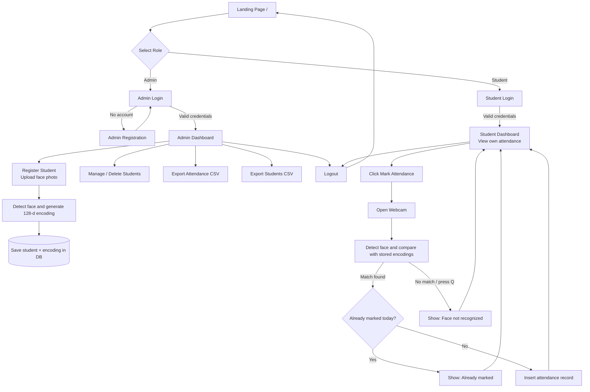

# 🎯 FaceLog – Face Recognition Attendance System
 
FaceLog is a Flask-based web application that automates student attendance using **face recognition**. Admins register students (with a face photo), and students mark their attendance by simply showing their face to the webcam. Attendance records are stored in a MySQL database and can be exported as CSV files.
 
---
 
## ✨ Features
 
### 👨‍💼 Admin
- Secure admin registration & login (hashed passwords)
- Dashboard showing all attendance records (latest first)
- Register new students with a face image (face encoding is generated and stored automatically)
- View and delete students
- Export **attendance records** as CSV
- Export **student records** as CSV
### 🎓 Student
- Secure login with full name, email & password
- Personal dashboard showing own attendance history
- One-click **face-recognition attendance** through the webcam
- Duplicate protection – attendance can only be marked **once per day**
- Timestamps use Indian Standard Time (`Asia/Kolkata`)
---
 
## 🛠️ Tech Stack
 
| Layer      | Technology                                  |
|------------|---------------------------------------------|
| Backend    | Python, Flask                               |
| Database   | MySQL (Aiven Cloud MySQL supported)         |
| Face Recognition | `face_recognition` (dlib), OpenCV, NumPy |
| Image Handling | Pillow                                  |
| Security   | Werkzeug password hashing, Flask sessions   |
| Frontend   | HTML, CSS, Jinja2 templates                 |
 
---
 
## 📋 Requirements
 
### System Requirements
- Python **3.8 or higher**
- A working **webcam** (the app opens the camera on the machine running the server)
- MySQL database (local or cloud, e.g. Aiven)
- **CMake** and a C++ compiler (needed to build `dlib` for `face_recognition`)
  - Windows: Visual Studio Build Tools (C++ workload) + CMake
  - Linux: `sudo apt install build-essential cmake`
  - macOS: `brew install cmake`
### Python Packages
```
Flask
Flask-SQLAlchemy
mysql-connector-python
opencv-python
face_recognition
numpy
Pillow
pytz
Werkzeug
```
 
Save the above as `requirements.txt` and install with:
```bash
pip install -r requirements.txt
```
 
---
 
## 🗄️ Database Schema
 
Create a database (e.g. `FaceLog`) and the following tables:
 
```sql
CREATE TABLE Admin (
    Admin_id INT AUTO_INCREMENT PRIMARY KEY,
    full_name VARCHAR(100) NOT NULL,
    email VARCHAR(150) NOT NULL UNIQUE,
    password VARCHAR(255) NOT NULL
);
 
CREATE TABLE Student (
    id INT AUTO_INCREMENT PRIMARY KEY,
    full_name VARCHAR(100) NOT NULL,
    email VARCHAR(150) NOT NULL UNIQUE,
    password VARCHAR(255) NOT NULL,
    image VARCHAR(255),
    face_encoding BLOB NOT NULL
);
 
CREATE TABLE Attendance (
    id INT AUTO_INCREMENT PRIMARY KEY,
    user_id INT NOT NULL,
    username VARCHAR(100) NOT NULL,
    date_time DATETIME NOT NULL,
    attendance BOOLEAN NOT NULL DEFAULT TRUE,
    FOREIGN KEY (user_id) REFERENCES Student(id) ON DELETE CASCADE
);
```
 
---
 
## ⚙️ Installation & Setup
 
1. **Clone the repository**
```bash
   git clone <your-repo-url>
   cd FaceLog
```
 
2. **Create a virtual environment**
```bash
   python -m venv venv
   source venv/bin/activate      # Windows: venv\Scripts\activate
```
 
3. **Install dependencies**
```bash
   pip install -r requirements.txt
```
 
4. **Configure environment variables** (never hard-code credentials)
   Create a `.env` file or export these variables:
```
   SECRET_KEY=your-random-secret-key
   DB_HOST=your-database-host
   DB_PORT=3306
   DB_USER=your-database-user
   DB_PASSWORD=your-database-password
   DB_NAME=FaceLog
```
 
5. **Create the database tables** using the SQL schema above.
6. **Run the application**
```bash
   python app.py
```
 
7. Open **http://127.0.0.1:5000** in your browser.
---
 
## 🔄 Website Flow
 

 
### Step-by-Step Explanation
 
**1. Admin flow**
1. Admin opens the landing page and goes to **Admin Login** (or **Registration** if new).
2. After login, the **Admin Dashboard** lists every attendance record.
3. Admin registers a student by uploading a clear face photo. The system detects the face, converts it to a numeric encoding and stores it in the database with the student's details.
4. Admin can manage/delete students and download attendance or student data as CSV files.
**2. Student flow**
1. Student logs in with full name, email and password.
2. The student dashboard shows their personal attendance history.
3. On clicking **Mark Attendance**, the webcam opens and the live frame is compared with all stored face encodings (match tolerance `0.6`).
4. If the face is recognized and attendance isn't already marked for today, a new record is saved with the current IST time.
5. The student is redirected back to the dashboard with a success / info / error message.
---
 
## 🌐 Application Routes
 
| Route                       | Method     | Description                          | Access  |
|-----------------------------|------------|--------------------------------------|---------|
| `/` , `/facelog_home`       | GET        | Landing page                         | Public  |
| `/admin_registration`       | GET, POST  | Register a new admin                 | Public  |
| `/admin_login`              | GET, POST  | Admin login                          | Public  |
| `/admin_home`               | GET        | Admin dashboard (all attendance)     | Admin   |
| `/student_register`         | GET, POST  | Register student with face image     | Admin   |
| `/remove_students`          | GET        | List / manage students               | Admin   |
| `/delete_student/<id>`      | GET        | Delete a student                     | Admin   |
| `/export_attendance`        | GET        | Download attendance CSV              | Admin   |
| `/export_students_record`   | GET        | Download students CSV                | Admin   |
| `/login`                    | GET, POST  | Student login                        | Public  |
| `/student_attendance`       | GET        | Student dashboard                    | Student |
| `/mark_attendance`          | GET        | Webcam face-recognition attendance   | Student |
| `/logout`                   | GET        | Log out                              | Any     |
 
---
 
## 📁 Project Structure
 
```
FaceLog/
│── app.py
│── requirements.txt
│── static/
│   └── uploads/
│── templates/
│   ├── FaceLog_home.html
│   ├── Admin/
│   │   ├── admin_login.html
│   │   ├── admin_registration.html
│   │   ├── admin_home.html
│   │   └── admin_manage_students.html
│   └── Student/
│       ├── student_login.html
│       ├── student_registration.html
│       └── student_home.html
```
 
---
 
## ⚠️ Notes
 
- The webcam is accessed **server-side** (`cv2.VideoCapture(0)`), so the app must run on a machine with a camera, i.e. locally. Cloud hosting will not be able to open a webcam.
- Press **Q** in the camera window to cancel attendance marking.
- Use good lighting and a clear, front-facing photo when registering students for best accuracy.
- Keep secrets (DB password, `SECRET_KEY`) in environment variables and never commit them to GitHub.
---
 
## 🚀 Future Improvements
 
- Admin-only protection on all management routes
- Browser-based webcam capture (WebRTC) so it works when deployed
- Liveness detection to prevent photo spoofing
- Attendance analytics and charts
- Email notifications for absent students
---
 
## 👨‍💻 Author
 
**Rohit Sul**
 
🔗 LinkedIn: [https://www.linkedin.com/in/rohit-sul-780265283/](https://www.linkedin.com/in/rohit-sul-780265283/)
 
---
 
⭐ If you found this project useful, consider giving it a star!
